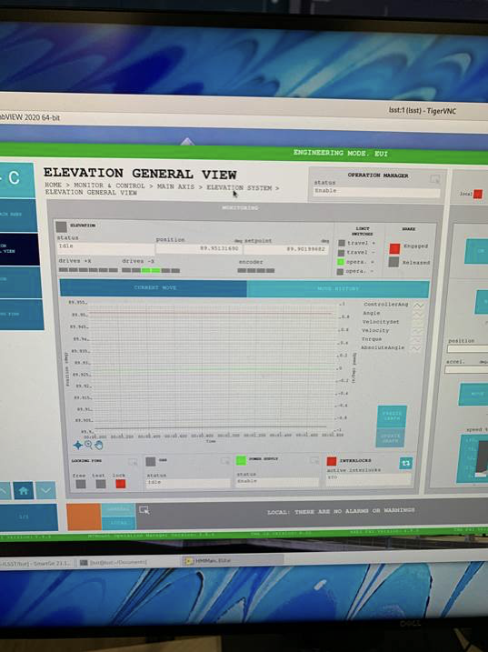

:tocdepth: 1

.. sectnum::

.. Metadata such as the title, authors, and description are set in metadata.yaml

.. TODO: Delete the note below before merging new content to the main branch.

Abstract
========

This technote is linked with `SITCOM-910`_

The TMA is elevation assembly is balanced using the measured torques of the elevation motors.
But we have found balancing the elevation assembly, using the provided equipment and procedure, impossible.
In particular, there is substantial hysteresis in the required torque and there is a discontinuous jump in torque required to point the telescope at the horizon (below 3.85 deg).
The discontinuity is likely caused by the magnet rail on the elevation axis ending at 3.85 deg.
We found that rebalancing using a procedure that excluded measurements from elevations below 5 deg resulted in a much more well-behaved torque profile, although some hysteresis remains.
We also present well-behaved torque profiles for purely azimuth slews.

.. _SITCOM-910: https://jira.lsstcorp.org/browse/SITCOM-910

.. _introduction:

Introduction
============

After installing the M1M3 cell and attempting to balance the TMA for the first time, using the provided equipment and procedure, we have noticed a few issues.
First, even after balancing we are seeing larger than expected and unstable torques are required to move the telescope and hold it in position.
Additionally, there is a hysteresis in the torque profiles (between upward and downward slews).
Finally, we are seeing elevation dependent behavior in the torque profiles that would not occur for a balanced telescope. This unstable behavior includes both large scale variations as a function of elevation and discrete jumps at 3.85 deg.

.. _description:

Description of elevation torque behavior post initial balancing
===============================================================

Initial balancing efforts left some interesting features in torque profiles during a slew.
The :ref:`profile <profile-before-balancing>` below, shows a pair of upward and downward 90 degree of slews from June, 27, 2023.
To reduce the inertial and hydrostatic bearing drag to negligible levels these slews were run at 1% of maximum speed.
There are four important characteristics of this profile:

1. For low elevation angles, less than 3.85, *deg* there is a sudden negative jump in the required torque of ~ 4 *kNm*.
2. There is a directional motion torque hysteresis of 7 kNm (+/-3.5kNm) which behaves as if there is a large drag when there should be negligible drag. Although not shown in this plot, this large torque change occurs whenever the direction is changed.
3. The elevation assembly has average torques near zero for horizon pointing and zenith pointing, but the intermediate elevation angles show an angle dependence that would be expected from an out of balance telescope.
4. Although there is a large hysteretic change in the torque, the small changes that appear to be noise are actual very consistent with elevation angle. The upward and downward curves are very similar, just offset.

.. figure:: ./_static/elevation_slews_before_balancing_20230627.png
   :name: profile-before-balancing

   Here we show the torque required as a function of elevation for 90 degree slews upward (downward) in green (purple). For each slew the shaded area shows the raw measurements from the EFD, and the line shows a rolling mean. A jump in the torque required can be seen at 3.85 degrees, and the rest of the torque profile displays significant hysteresis and dependence on elevation.
.. chage name to before final balancing.

Unstable torques
----------------
Here we show a sudden jump of ~4000 *kNm* that occured prior to the installation of the M1M3 mirror cell.
Include figure.

High elevation torque anomaly
-----------------------------
A similar anomaly in the elevation torque value occurs near zenith, see the :ref:`chronograf screenshot below <high-eleveation-profile>`. The elevation assembly can be balanced through the operation of the motorized balancing units to 0.4 kNm when locked at zenith (89.95). However as soon as the elevation assembly is driven of zenith a 2.2 kNm jump occurs. Once off zenith the interlocks prevent the rebalancing of the elevation assembly.  No likely cause has been determine for this zenith anomaly.

.. figure:: ./_static/torque_anomaly_near_zenith.png
   :name: high-eleveation-profile

   Torque anomaly near zenith pointing.

.. _possible-causes:

Possible causes for low elevation behavior
==========================================

A number of possible causes for this behavior were considered.
These included the elevation breaks, elevation axis hard points, TMA balance, cooling cables and finally the *elevation drives themselves*. We report our findings for the elevation axis motor investigation in the subsequent subsection :ref:`Elevation axis motors <elevation-axis-motors>`. All other investigations are detailed in :ref:`the Appendix <appendix-possible-causes>`

.. _elevation-axis-motors:

Elevation axis motors
---------------------

After some investigation, we think missing elevation structure magnets are the likely cause of the 3.85 *deg* jump in torque required, and this torque feature complicated our attempts at the balancing process.

For elevation slews the system is driven by magnets in a mobile cradle structure, the drive assembly, located on the "ground" (azimuth). To drive the system the magnets slide between pairs of phase drives. There are 3 pairs of drives on each side of the TMA.

The state of the system when the elevation is at the zenith, is shown :ref:`below <drive-at-zentih>`. Importantly, there is still ~ 20 *cm* of a magnet that will never get into the drives, as an extra longitude of the magnets track. The only way that this extra-length get in-between the drives is moving the elevation to impossible angles as +100 *deg*.

   Elevation magnet drive at zenith (90 *deg*)

However, when the telescope reaches an elevation 3.5 *deg* above the horizon **the magnetic track ends**.

.. figure:: ./_static/magnet_drive_horizon.png
   :name: drive-at-horizon

   Elevation magnet drive at 3.5 *deg*

This means that when the elevation is at 0 *deg* (horizon), there are ~25 *cm* of drives that are empty; they have no magnets to act-on.

.. figure:: ./_static/magnet_drive_horizon_2.png
   :name: drive-at-horizon-2

   Elevation magnet drive at 0 *deg*

The actual length of the magnetic arc is likely adequate. When the telescope is zenith pointing, a significant portion of the magnets, ~20 cm, are still outside the phase drives, figure 5. This is approximately equivalent to the missing portion for horizon pointing, and so appears to be a design flaw.

Updated Torque profiles
=======================

Taking the :ref:`previously descibed <elevation-axis-motors>` findings into account, we repeated the balancing procedure while ignoring the elevation range between 0 *deg* and 5 *deg*.
This was difficult since it was incompatible with both the balancing procedure and the balancing equipment.
The procedure requires balancing the y-axis at zenith pointing and the z-axis at horizon pointing. The axes are balanced by driving motorized balancing units.
The units are interlocked so then cannot be operated other than horizon pointing or zenith pointing, when the elevation pins are inserted.

The :ref:`figure below <after-balancing>` shows the updated measured torque profiles for the elevation range 5-90 *deg*. This does not include the problematic region of 0-5 *deg*.  We show slew profiles at two different velocity configurations, 1% (0.05 *deg/s*) and 10% (0.5 *deg/s*) of the designed max velocity (5.25 *deg/s* TLS-REQ-0159). Upward slews are shown in orange and downward slews in blue. It can be seen that for both configurations the majority of the observed variation in required torque as a function of elevation is gone. The torque hysteresis appears to be reduced to ~ 4 *kNm* (+/- 2 *kNm*) and have little dependence on the speed of the slew.

.. figure:: ./_static/elevation_slews_after_balancing_20230630.png
   :name: after-balancing

   Each panel shows required torque as a function of elevation for slews between 0 and 90 *deg*. Upward slews are shown in orange and downward slews in blue, the lighter shaded area shows raw measured values, and the darker line denotes a rolling mean. The top (bottom) panel shows a pair of slews at 1% (10%) of the designed maximum velocity.

Next, we show a comparison of the torque profiles before and after masking the 0-5 *deg* region. This figure makes it clear that the majority of the previously observed hysteresis was due to trying to account for the heterogenously behaved low elevation region. All slews are run at 1% velocity configuration.

.. figure:: ./_static/elevation_slews_comparison_20230630.png
   :name: compare-slews

   A comparison of required torque as a function of elevation. This demonstrates the improvement in hysteresis gained by balancing the telescope while masking out the region from 0-5 *deg*

Disabled Elevation Drives
=========================
According to the EUI Elevation drives 31 and 32, figure 9, are not enabled when operating, figure 10.
The EUI shows Elevation drives 31 and 32 disabled.
Notice on the pictures all the other drives are enabled when 31 and 32 are disabled.
It is possible that the logic is inverted.
Because when all other drives are enabled, 31 and 32 are disabled.
Note: The drives are mislabeled. Drives 31 and 32 are physically on +X side, but according to the EUI they are on the -X side.

Left image: Drives 31 and 32 on the +X axis

Right image: EUI screenshot showing drives 31 and 32 enabled when the rest are disabled. The opposite behaviour is also observed (31,32 disabled when the rest are enabled)

Azimuth torque profiles
=======================
Finally, we show the torque profiles for 4 pairs of azimuth slews run at 5% of the designed maximum velocity. These show the low hysteresis of the system for azimuth slews, with fairly little dependence on the telescope elevation.

.. figure:: ./_static/azimuth_slews_20230630.png
   :name: azimuth-slews

   Here we show the required torque as a function of azimuth angle over the range of 70-250 *deg*. The color of the line denotes the type of slew (positive/negative) and the system state (telescope elevation=90/0).

Open issues to be fixed/investigated
====================================
It is not possible to balance the telescope within the TMA requirements with the present situation.
This increases the risk of a dangerous unintended motion and produces unnecessary image degrading heat.
The torque hysteresis will also likely produce difficulties in pointing and tracking.

1. It should be verified that the torque reversal near horizon pointing is produced by the premature truncation of the elevation magnets. If corrective action is shown to be impractical, the software interlocks should be modified to allow operation of the balancing units without the elevation pins inserted horizon pointing, and a new procedure produced for balancing the elevation assembly with the equipment available.

2. The cause of the torque jump near zenith pointing should be determined and eliminated if possible. If not the software interlocks should be modified to allow operation of the balancing units without the elevation pins inserted zenith pointing.

3. The cause of the torque hysteresis should be determined and eliminated. As a result of the EUI it is possible that magnets 31 and 32 are operating incorrectly or reporting their torques (current) incorrectly. If this deficiency is not related to the torque hysteresis it should be corrected regardless. The +x and –x should be labelled correctly. If the large torque hysteresis is produced by another phenomenon this still needs to be determined and rectified. The telescope cannot be properly operated under these conditions.

.. _appendix-possible-causes:

Appendix: other considered causes of the torque behavior
=========================================================

Elevation breaks
----------------

We checked for possible contact of the elevation brakes and the TMA during slews causing a dragging effect.
This was done in a few different ways.
First, by looking at the wear patterns between the break pads and the elevation axis at different elevations, there seemed to be some variance in the wear but nothing obvious (see images below or `SUMMIT-7581`).
Then, we took infrared images of the TMA during slews no hot points were detected.
Finally, we measured the distance between the break pads and the TMA at multiple elevations while the breaks were released finding at no points did the breaks make contact with the axis during a slew.

.. _SUMMIT-7581: https://jira.lsstcorp.org/browse/SUMMIT-7581

.. image:: _static/tma_brake_plate1.png
   :width: 32 %
.. image:: _static/tma_brake_plate2.jpeg
   :width: 32 %
.. image:: _static/tma_brake_plate_with_metal_powder.jpg
   :width: 32 %

A few images of the TMA break plates showing wear, and metal powder.

Elevation Axis Hard Stops
-------------------------
We also slewed the telescope to elevations of 7,3 and 0 deg and visually checked whether the hard stops were engaged in a way that could possibly explain the behavior at 3.5 deg.
It was found this was not possible, and **notably** it looked like the hard stops would engage at a negative **after** the TMA would have encountered portions of the dome floor.

.. TMA Balance iterations
.. ^^^^^^^^^^^^^^^^^^^^^^

Other systems on the TMA that could cause drag during slews
^^^^^^^^^^^^^^^^^^^^^^^^^^^^^^^^^^^^^^^^^^^^^^^^^^^^^^^^^^^
- Cables/lines on the TMA: A visual check was done on/around the TMA, no objects were found to be obviously touching during a slew, but some refrigeration lines were close. The new cable wraps, applied on the week of July 03rd, should help to further prevent any contact or dragging.

.. - excell spreasdsheet from doug --> transfer to python and fit? see ticket

.. Make in-text citations with: :cite:`bibkey`.
.. Uncomment to use citations
.. .. rubric:: References
..
.. .. bibliography:: local.bib lsstbib/books.bib lsstbib/lsst.bib lsstbib/lsst-dm.bib lsstbib/refs.bib lsstbib/refs_ads.bib
..    :style: lsst_aa
