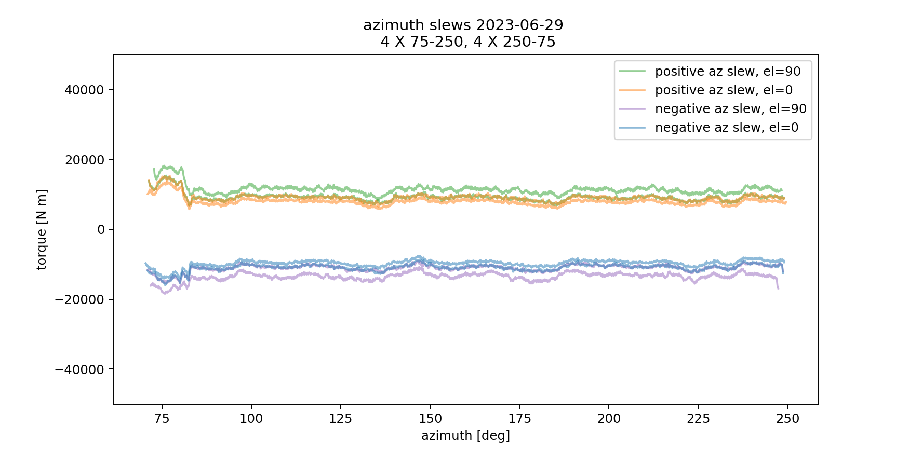

:tocdepth: 1

.. sectnum::

.. Metadata such as the title, authors, and description are set in metadata.yaml

.. TODO: Delete the note below before merging new content to the main branch.

.. note::

   **This technote is a work-in-progress.**

Abstract
========

This technote is linked with `SITCOM-910`_

After initial balancing of the TMA we have noticed larger than expected torques, as well as unusual torque profiles. This behavior was likely caused by the asymmetric distribution of magnets in the elevation drive. For slews lower than 3.5 degrees not all drives were able to fully function. Rebalancing excluding elevations below 5 deg resulted in more well-behaved torque profiles. We also present torque profiles for purely azimuth slews.

.. _SITCOM-910: https://jira.lsstcorp.org/browse/SITCOM-910

.. _introduction:

Introduction
============

After installing the M1M3 cell we have noticed a few issues.
First, even after balancing we are seeing larger than expected torques required to move the telescope (we would expect this to be close to 0). (is this still true?)
Additionally, there is a hysteresis in the torque profiles (between upward and downward slews).
Finally, we are seeing elevation dependent behavior in the torque profiles (amount required to slew, and a jump in torque at different elevations such as 3 deg).

.. _description:

Description of elevation torque behavior post initial balancing
===============================================================

Initial balancing efforts left some interesting features in torque profiles during a slew.
The :ref:`profile <profile-before-balancing>` below, shows a pair of upward and downward 90 degree of slews from June, 27, 2023.
Most notably, there is large jump of ~ 3 *kNm* in required torque at 3.5 *deg* of elevation, as well as a large hysteresis and change in required torque as function of elevation for all elevations, not just 3.5 deg.

.. figure:: ./_static/elevation_slews_before_balancing_20230627.png
   :name: profile-before-balancing

   Here we show the torque required as a function of elevation for 90 degree slews upward (downward) in green (purple). For each slew the shaded area shows the raw measurements from the EFD, and the line shows a rolling mean. A jump in the torque required can be seen at 3.5 degrees, and the rest of the torque profile is not symmetric around the torque = 0 Nm line.
.. chage name to before final balancing.

.. _possible-causes:

Possible causes
=================================

A number of possible causes for this behavior were considered.
These included the elevation breaks, elevation axis hard points, TMA balance, cooling cables and finally the *elevation drives themselves*. We report our findings for the elevation axis motor investigation in the subsequent subsection :ref:`Elevation axis motors <elevation-axis-motors>`. All other investigations are detailed in :ref:`the Appendix <appendix-possible-causes>`

.. _elevation-axis-motors:

Elevation axis motors
---------------------

After some investigation, we think missing elevation structure magnets are the likely cause of the 3.5 *deg* jump in torque required, and this torque feature complicated our attempts at the balancing process.

For elevation slews the system is driven by magnets in a mobile cradle structure, the drive assembly, located on the "ground" (azimuth). To drive the system the magnets slide between pairs of phase drives. There are 3 pairs of drives on each side of the TMA.

The state of the system when the elevation is at the zenith, is shown :ref:`below <drive-at-zentih>`. Importantly, there is still ~ 20 *cm* of a magnet that will never get into the drives, as an extra longitude of the magnets track. The only way that this extra-length get in-between the drives is moving the elevation to impossible angles as +100 *deg*.

.. figure:: ./_static/magnet_drive_zenith.png
   :name: drive-at-zentih

   Elevation magnet drive at zenith (90 *deg*)

However, when the telescope reaches an elevation 3.5 *deg* above the horizon **the magnetic track ends**.

.. figure:: ./_static/magnet_drive_horizon.png
   :name: drive-at-horizon

   Elevation magnet drive at 3.5 *deg*

This means that when the elevation is at 0 *deg* (horizon), there are ~25 *cm* of drives that are empty; they have no magnets to act-on.

.. figure:: ./_static/magnet_drive_horizon_2.png
   :name: drive-at-horizon-2

   Elevation magnet drive at 0 *deg*

Updated Torque profiles
=======================

Taking the :ref:`previously descibed <elevation-axis-motors>` findings into account, we repeated the balancing procedure while ignoring the elevation range between 0 *deg* and 5 *deg*.

The :ref:`figure below <after-balancing>` shows the updated measured torque profiles for the elevation range 5-90 *deg*. This does not include the problematic region of 0-5 *deg*.  We show slew profiles at two different velocity configurations, 1% (XX *deg/s*) and 10% (XX *deg/s*) of the designed max velocity (XX *deg/s* **ref LVV**). Upward slews are shown in orange and downward slews in blue. It can be seen that for both configurations the majority of the observed hysteresis is gone, and we are left with a more symmetric torque profile.

.. figure:: ./_static/elevation_slews_after_balancing_20230630.png
   :name: after-balancing

   Each panel shows required torque as a function of elevation for slews between 0 and 90 *deg*. Upward slews are shown in orange and downward slews in blue, the lighter shaded area shows raw measured values, and the darker line denotes a rolling mean. The top (bottom) panel shows a pair of slews at 1% (10%) of the designed maximum velocity.

Next, we show a comparison of the torque profiles before and after masking the 0-5 *deg* region. This figure makes it clear that the majority of the previously observed hysteresis was due to trying to account for the heterogenously behaved low elevation region. All slews are run at 1% velocity configuration.

   A comparison of required torque as a function of elevation. This demonstrates the improvement in hysteresis gained by balancing the telescope while masking out the region from 0-5 *deg*

Finally, we show the torque profiles for 4 pairs of azimuth slews run at 5% of the designed maximum velocity. These show the low hysteresis of the system for azimuth slews, with fairly little dependence on the telescope elevation.

   Here we show the required torque as a function of azimuth angle over the range of 70-250 *deg*. The color of the line denotes the type of slew (positive/negative) and the system state (telescope elevation=90/0).
.. _appendix-possible-causes:

Appendix: other considered causes of the torque behavior
=========================================================

Elevation breaks
----------------

We checked for possible contact of the elevation brakes and the TMA during slews causing a dragging effect.
This was done in a few different ways.
First, by looking at the wear patterns between the break pads and the elevation axis at different elevations, there seemed to be some variance in the wear but nothing obvious (see images below or `SUMMIT-7581`).
Then, we took infrared images of the TMA during slews no hot points were detected.
Finally, we measured the distance between the break pads and the TMA at multiple elevations while the breaks were released finding at no points did the breaks make contact with the axis during a slew.

.. _SUMMIT-7581: https://jira.lsstcorp.org/browse/SUMMIT-7581

.. image:: _static/tma_brake_plate1.png
   :width: 32 %
.. image:: _static/tma_brake_plate2.jpeg
   :width: 32 %

A few images of the TMA break plates showing wear, and metal powder.

Elevation Axis Hard Stops
-------------------------
We also slewed the telescope to elevations of 7,3 and 0 deg and visually checked whether the hard stops were engaged in a way that could possibly explain the behavior at 3.5 deg.
It was found this was not possible, and **notably** it looked like the hard stops would engage at a negative **after** the TMA would have encountered portions of the dome floor.

.. TMA Balance iterations
.. ^^^^^^^^^^^^^^^^^^^^^^

Other systems on the TMA that could cause drag during slews
^^^^^^^^^^^^^^^^^^^^^^^^^^^^^^^^^^^^^^^^^^^^^^^^^^^^^^^^^^^
- Cables/lines on the TMA: A visual check was done on/around the TMA, no objects were found to be obviously touching during a slew, but some refrigeration lines were close. The new cable wraps, applied on the week of July 03rd, should help to further prevent any contact or dragging.

.. - excell spreasdsheet from doug --> transfer to python and fit? see ticket

.. Make in-text citations with: :cite:`bibkey`.
.. Uncomment to use citations
.. .. rubric:: References
..
.. .. bibliography:: local.bib lsstbib/books.bib lsstbib/lsst.bib lsstbib/lsst-dm.bib lsstbib/refs.bib lsstbib/refs_ads.bib
..    :style: lsst_aa
